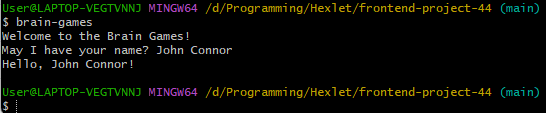
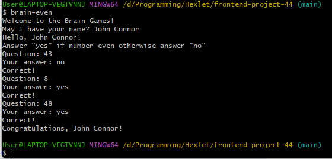
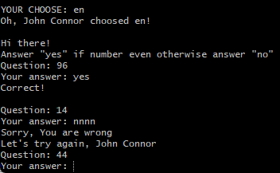
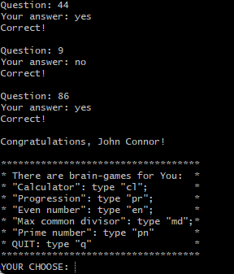
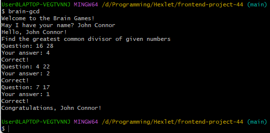

### Hexlet tests and linter status:

#### 1 Start brain-games and userName request

#### 2 Game brain-even, successful

#### 3 Game brain-even, unsuccessful

#### 4 Successful game brain-progression

#### 5 Successful game brain-gcd

